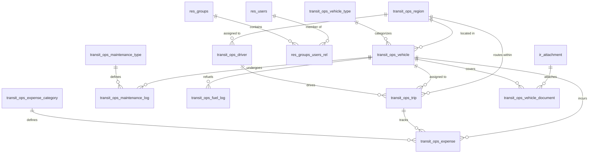

# TransitOps Fleet Operations Management System
## Design & Architecture Specification

This document details the front-end layout, user interface components, design tokens, and database schema mappings for the **TransitOps Fleet Operations Management System** based on the Stitch mockup project and the PostgreSQL database schema.

---

## 1. Design System & Aesthetics ("Sahara" Theme)

The system utilizes the **Sahara — Warm Minimalism** design system to deliver a premium, editorial, and highly functional interface for logistics management.

### Typography
- **Headlines & Display:** `EB Garamond` — Elegant, classic serif font. Used for page headers, brand identity, and key KPI values.
- **Body & Labels:** `Manrope` — Clean, geometric sans-serif. Used for form labels, table cells, metadata, and buttons to ensure high legibility.

### Color Palette
The colors are shifted toward warm, sun-baked earth tones:
- **Primary:** Burnt Sienna (`#c2652a`) — Used for primary call-to-actions, focus states, and accent highlights.
- **Secondary:** Warm Charcoal (`#78706a`) — Used for secondary headers, secondary buttons, and icons.
- **Tertiary:** Dusty Rose (`#8c3c3c`) — Used sparingly for system alerts, warnings, and highlighting exceptions.
- **Background:** Warm Linen (`#faf5ee`) — The base background color for pages.
- **Surface (Lowest):** Pure White (`#ffffff`) — Base container card background.
- **Surface (Low):** Soft Linen-Gray (`#f6f0e8`) — Alternating rows, input backgrounds, or secondary panels.
- **Neutral Variant:** Dark Charcoal (`#605850`) — Used for body text and descriptive labels.
- **Outline/Borders:** Soft Warm Gray (`#d8d0c8` or `#9a9088`) — Used for thin borders and division lines.

### Shapes & Elevation
- **Card Corners:** Container panels feature a `32px` corner radius.
- **Controls & Buttons:** Form inputs, selects, and action buttons use an `8px` or `12px` corner radius.
- **Elevation:** Ultra-soft, diffused shadows. Default shadow token: `0 2px 16px rgba(58, 48, 42, 0.04)`.
- **Layout Rhythm:** Built on a `4px` grid unit (typical card gaps are `12px` to `24px`; internal card padding is `28px` to `32px`).

---

## 2. Screen-to-Database Mapping & Functional Analysis

Below is the design breakdown of the 9 core screens including UI components, actions, and their exact backend mappings.

### 2.1 Login & Authentication
- **Mockup Source:** `login_authentication.html`
- **Purpose:** Secure entry point with role-based redirection.
- **UI Components:**
  - *Left Sidebar:* Brand introduction ("Sahara Fleet") with cards summarizing core value propositions (Global Logistics, Smart Dispatching, Real-time Analytics).
  - *Login Card:* 32px rounded container with a "Secure Access" lock badge, `Email` input (with icon), `Password` input (with key icon), `Remember Me` checkbox, and "Sign In" CTA.
  - *Background:* Absolute layout container hosting a warm parchment topographical map vector.
- **Database Mapping:**
  - Reads from `res_users` (checks login and password hashes).
  - Authenticated via Supabase auth (maps to `public.profiles` and `public.user_roles`).
- **Validation Logic:**
  - Login fails if user status `active = false` in `res_users`.
  - Authentication status determines role-based redirect via backend middleware.

---

### 2.2 Main Dashboard
- **Mockup Source:** `main_dashboard.html`
- **Purpose:** Central operational overview displaying high-level metrics, active vehicles, speed tracking, and real-time warnings.
- **UI Components:**
  - *Filter Bar:* Dropdown selectors for Region (e.g., Maharashtra, Karnataka, Delhi) and Status (Available, On Delivery, In Transit, Loading, Breakdown, Maintenance).
  - *KPI Cards:* Grid displaying Active Vehicles, Available Vehicles, Vehicles in Maintenance, Active Trips, Pending Trips, Drivers On Duty, and Fleet Utilization % (88%).
  - *Vehicle Focus Panel:* Live status card for a selected vehicle (e.g., `LOG7614390`) displaying odometer mileage, capacity bar (`8,500 / 15,000 lb`), and speed tracking gauge.
  - *Alerts Sidebar:* "Recent Alerts" timeline (Route Deviation, Service Required, Delayed Delivery) with colored priority icons and relative timestamps (e.g., "2m ago").
- **Database Mapping:**
  - Reads summary data from database view `public.v_dashboard_kpis`.
  - Reads alert logs and logs from `transit_ops_vehicle`, `transit_ops_trip`, and `transit_ops_driver`.
- **Actions:**
  - "Add New Shipment" button redirects to Trip Dispatcher.
  - "View All Alerts" button redirects to notification filters.

---

### 2.3 Vehicle Registry
- **Mockup Source:** `vehicle_registry.html`
- **Purpose:** Master catalog of all vehicles in the transit network.
- **UI Components:**
  - *Counters Grid:* Stats for Total Fleet (124), On Trip, In Shop, and a Fleet Excellence card showing monthly efficiency trends (+14%).
  - *Search & Filters:* Text search bar ("Search registry...") and filter dropdowns (Region, Status, Vehicle Type).
  - *Registry Table:* List of vehicles showing Registration Number, Model, Type (Truck/Van/Car), Capacity (progress bar), Odometer (mi/km), Daily Cost, and Status badge.
  - *Action Buttons:* "Add New Shipment", "Edit Details" (pencil icon), "View History" (eye icon) for each row.
- **Database Mapping:**
  - Queries `transit_ops_vehicle` joined with `transit_ops_vehicle_type` and `transit_ops_region`.
- **Validation Rules:**
  - Status column must mirror business states: `'Available'`, `'On Trip'`, `'In Shop'`, or `'Retired'`.
  - Updates to odometer values must be monotonically increasing.

---

### 2.4 Driver Management
- **Mockup Source:** `driver_management.html`
- **Purpose:** Driver profiling, licensing checks, safety audits, and scheduling.
- **UI Components:**
  - *Filter Badges:* Horizontal pill selectors (All Drivers, Category A, Category B, HGV Specialist).
  - *Driver Cards Grid:* Grid of profile cards displaying:
    - Driver's photo, name, and status badge (`Available`, `On Trip`, `Off Duty`, `Suspended`).
    - Safety score (out of 100).
    - Active Route status (e.g., "Phoenix ➔ San Diego").
    - License expiry date (with automated warning colors if approaching/expired).
    - Contact phone/email links.
  - *Action Buttons:* "View Profile", "Track Location", "Edit Details", "Incident Report", and a dotted "Onboard New Driver" card.
- **Database Mapping:**
  - Queries `transit_ops_driver` joined with `res_users` and `transit_ops_region`.
- **Validation Rules:**
  - License validation: Triggers `transit_ops_trip_validation_and_lifecycle_fn()` on dispatch. If license expiry is prior to dispatch date, the dispatch is blocked.
  - Drivers with a `'Suspended'` status cannot be assigned to any trip.

---

### 2.5 Trip Dispatcher & Lifecycle
- **Mockup Source:** `trip_dispatcher_lifecycle.html`
- **Purpose:** Console to configure shipments, allocate vehicles/drivers, build cargo manifests, and dispatch trips.
- **UI Components:**
  - *Lifecycle Tracker:* Stepper indicator displaying current trip stage (`Draft` ➔ `Dispatched` ➔ `Completed` ➔ `Cancelled`).
  - *Route Configuration:* Origin dropdown, Destination address text input, and calculated metrics (Est. Distance, Est. Travel Time).
  - *Asset Allocation:* Vehicle and Driver search/select panels displaying status warning banners (e.g., "In Shop" or "Suspended" blocks).
  - *Cargo Manifest Card:* Weight calculator card (`8,500 / 15,000 lb` progress bar) with pallet counts, fragile tags, and oversized cargo toggles.
  - *Trips Ledger Table:* Recent trips list displaying Trip ID, Route, Vehicle/Driver, Status badge, Cargo weight, and options menu.
- **Database Mapping:**
  - Inserts and updates records in `transit_ops_trip`.
  - Validates and cascades statuses into `transit_ops_vehicle` and `transit_ops_driver`.
- **Trigger Actions:**
  - **Save Draft:** Inserts/updates `transit_ops_trip` with state `Draft`.
  - **Dispatch Trip:** Triggers validation function `transit_ops_trip_validation_and_lifecycle_fn()` which:
    1. Checks if cargo weight exceeds vehicle capacity.
    2. Validates that the driver is not `Off Duty`, `Suspended`, or already on another active trip.
    3. Validates that the vehicle is not `Retired`, `In Shop`, or already on another active trip.
    4. Automatically sets vehicle and driver statuses to `'On Trip'`.
    5. Sets `dispatch_datetime` to current timestamp.
  - **Complete Trip:** requires inputting the `end_odometer` and calculates `actual_distance`. Automatically returns vehicle and driver status to `'Available'`.

---

### 2.6 Maintenance Log
- **Mockup Source:** `maintenance_log.html`
- **Purpose:** Schedule repairs, record maintenance history, and monitor fleet health.
- **UI Components:**
  - *Fleet Health Widget:* Fleet Health Score dial (94%), upcoming inspection warnings (V-20 in 4 days), and Average Service Cost indicator ($1,240).
  - *Schedule Maintenance Form:* Select Vehicle dropdown, Service Type selector (Engine, Brakes, Tire, Fluids, Inspection), Scheduled Date calendar, Estimated Cost, and notes field.
  - *Recent Service History:* Timeline showing service type details, cost metrics, status badges (`Completed`, `In Shop / In Progress`, `Archived`), and a PDF export option.
- **Database Mapping:**
  - Queries and inserts records in `transit_ops_maintenance_log` and `transit_ops_maintenance_type`.
- **Validation Rules:**
  - When a maintenance log's state changes to `Open` (In Progress), the trigger `transit_ops_maintenance_lifecycle_fn()` automatically updates the vehicle's status to `In Shop`, rendering it unavailable in the trip dispatcher.
  - When the log is updated to `Closed` (Completed), the vehicle status reverts to `Available` (or remains `Retired` if decommissioned).

---

### 2.7 Fuel & Expenses
- **Mockup Source:** `fuel_expenses.html`
- **Purpose:** Expense logging, fuel transaction records, and fleet cost summaries.
- **UI Components:**
  - *Record Fuel Card:* Transaction capture form with fields for Vehicle selection, Liters filled, total Cost ($), Date/Time, and Gas Station name.
  - *Operational Costs Chart:* High-fidelity comparison bar chart showing Fuel vs. Maintenance costs per vehicle ID (TR-761, VN-202, etc.) over 30 days.
  - *Efficiency & Projection Cards:* Cards displaying average MPG (e.g., `14.2`), monthly cost forecast (`$4.8k Est.`), and annual PDF report download utility.
  - *Expenses List Table:* Logs list showing Timestamp, Vehicle, Type (Fuel/Toll/Repair), Details (Liters or passage location), and Amount.
- **Database Mapping:**
  - Records logged to `transit_ops_fuel_log` (refueling logs) and `transit_ops_expense` (tolls, repairs, misc expenses).
- **Automation Logic:**
  - Database trigger `transit_ops_fuel_efficiency_fn()` automatically calculates fuel efficiency (`fuel_efficiency = (new_odometer - previous_odometer) / litres`) when a new fuel log is submitted, and updates the vehicle's master odometer.

---

### 2.8 Reports & Analytics
- **Mockup Source:** `reports_analytics_fleet_performance.html`
- **Purpose:** Advanced analytics dashboard for strategic decision-making and data export.
- **UI Components:**
  - *Analytical Overview Cards:* Grid displaying key statistics: Fuel Efficiency average (14.8 km/L), Fleet Utilization percentage (87.4%), Total Operational Cost ($420.5k), and Overall Vehicle ROI ratio (24.6%).
  - *Trendline Chart:* High-fidelity area/line chart comparing Monthly ROI Recovery from January to June.
  - *Data Export Center:* Actions cards to download raw datasets (CSV or PDF).
  - *Per-Vehicle Table:* Table displaying Vehicle details, Fuel Efficiency, Utilization rate, ROI score, status, and detail dropdown.
- **Database Mapping:**
  - Fetches aggregated operational data from `transit_ops_trip`, `transit_ops_fuel_log`, and `transit_ops_expense` tables.

---

### 2.9 Settings & RBAC
- **Mockup Source:** `settings_rbac.html`
- **Purpose:** Security configuration, measurement parameters, and system backups.
- **UI Components:**
  - *Tabs Navigation:* Secondary tabs for Platform settings, Integrations, and Billing.
  - *RBAC Matrix:* Table listing Role Names (e.g., Fleet Manager, Trip Dispatcher, Auditor), Access Levels (Owner, Standard, Restricted), User Counts, Status toggles, and edit actions.
  - *System Units:* Choice dropdowns for Distance standard (`Miles` or `Kilometers`) and Weight standard (`Pounds` or `Kilograms`).
  - *Notification Toggles:* Multi-checkbox list for Push Alerts, Email Summaries, SMS Dispatch, and Slack Sync.
  - *Data Integrity Panel:* Dangerous actions container housing "Archive Data Logs" utility.
- **Database Mapping:**
  - Reads and writes to `res_groups` (Role configuration) and `res_groups_users_rel` (user role associations).
  - Unit configurations map to user-specific settings or tenant settings.

---

## 3. Database Schema Overview & Triggers Reference

All screens read and write to the following relational PostgreSQL schema:

### Key Trigger Actions

1. **`transit_ops_trip_validation_and_lifecycle`**
   - *Table:* `transit_ops_trip`
   - *Timing:* `BEFORE INSERT OR UPDATE`
   - *Actions:* Checks cargo capacity limits, driver status restrictions, vehicle status availability, and license expirations. Automatically updates status to `'On Trip'` or `'Available'` on dispatch or completion.

2. **`transit_ops_maintenance_lifecycle`**
   - *Table:* `transit_ops_maintenance_log`
   - *Timing:* `BEFORE INSERT OR UPDATE`
   - *Actions:* Checks vehicle retirement constraints. On state = `'Open'`, updates vehicle status to `'In Shop'`. On state = `'Closed'`, returns vehicle to `'Available'`.

3. **`transit_ops_fuel_efficiency`**
   - *Table:* `transit_ops_fuel_log`
   - *Timing:* `BEFORE INSERT OR UPDATE`
   - *Actions:* Calculates MPG/KML based on odometer increments since the last refuel. Automatically updates the vehicle's odometer value.
